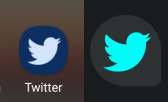
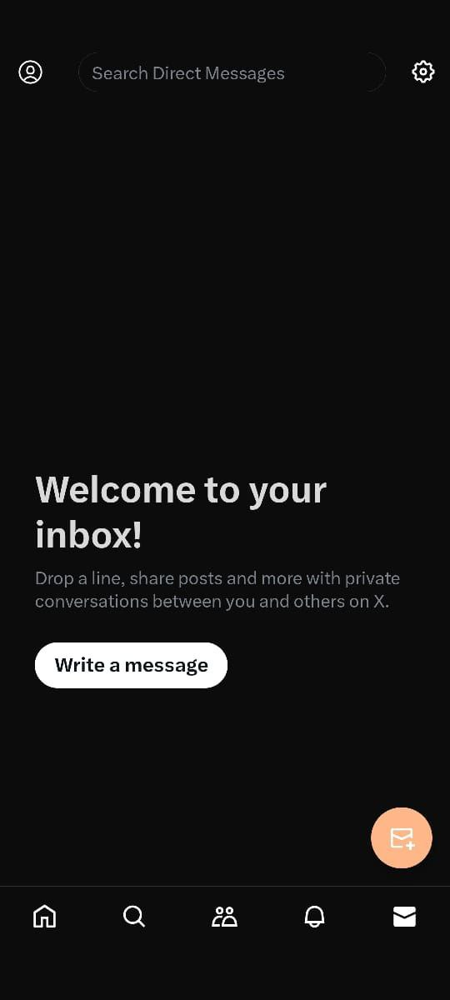

## Patches for twitter:

```kotlin
⦿ App wide Material Theme (replaces Dim)
⦿ Grey Theme (replaces LightsOut)
⦿ OG Twitter name and in app branding
⦿ Bird Splash screen and toolbar icon
⦿ Three Icon sets
⦿ Adaptive Monochrome Icon
⦿ Video downloads

-> from Revanced Official
⦿ Hide tweet View counts
⦿ Hide promoted users and AdBlock

-> from Crimera Piko
⦿ All Patches and settings menu (RIP originality)
```
## Usage

To use these patches, follow the steps below:

1. Make `IndusAryan` the organization for your Revanced app.
2. Set `twitter-patches` as the source for your patches.

<div style="display:flex; justify-content:space-between;">  
  
</div>  

## Warning:
Only use 1 icon patch and deselect other two otherwise; last applied patch will be used.

## Icons
<div style="display:flex; justify-content:space-between;">  
 

</div>  

## Screenshots

<div style="display:flex; flex-direction:row;">
  <div style="margin-right: 20px; text-align: center;">
    
  </div>

  <div style="margin-right: 20px; text-align: center;">
    
  </div>

  <div style="text-align: center;">
    
  </div>

<div style="text-align: center;">
    
  </div>

<div style="text-align: center;">
    
  </div>
</div>

## Contributing
If you would like to contribute to the project in any way better, you can PR.

## License
[](http://www.gnu.org/licenses/gpl-3.0.en.html)

These patches are fully FOSS. You can use, study, share and modify it at your will. They can be redistributed and/or modified under the terms of the [GNU General Public License](https://www.gnu.org/licenses/gpl.html) version 3 or later published by the Free Software Foundation.

---
### Info:
These patches are only for educational purpose and personal usages. They are safe and don't tamper with any application functionality in a negative way, neither they are capable of it. We are not affiliated with Revanced Project. This Repo also contains patches and parts from the Crimera piko and TheRealSwak, So many thanks to them and do star their awesome Repo. 
